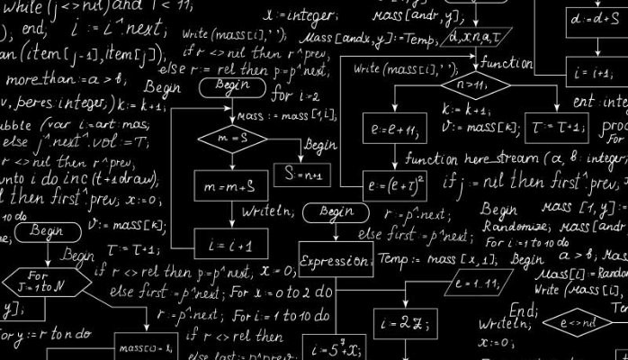
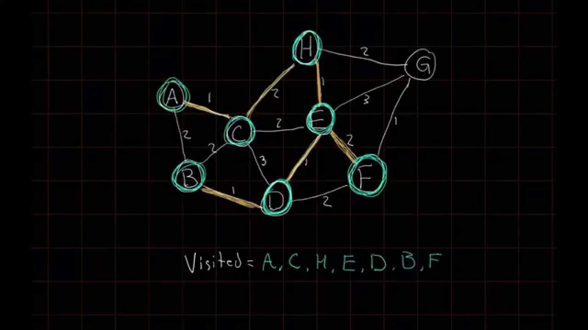

# The 10 must-know algorithms and data structures for an engineer

***

10! In current competitive world, this question should be renamed to 100 must-know algorithms. Still, lets try to categorize the algorithms in 10 broad categories.

But first, learning such a small subset(only 10!) will do no good. The more you learn, the more you will stand out from the crowd.

Learning and visualizing algorithms will change the way you tackle real life situation, you will always start looking for an optimized way to do things. And that's great, that's what smart people are - LAZY, yes, they always try to do more work with minimal effort and that's optimization.

Start developing algorithmic thinking by visualizing algorithms.

This is what I will recommend [IDeserve](http://www.ideserve.co.in/)

It's a cool platform where you can visualize the algorithms and data structures within it.
I feel it is largest source for algorithms which you can visualize. Its pretty cool to see algorithms being executed and animated on the fly.

Coming back to categorizing algorithms into 10 broad categories...phew...now this will take time.

---

## 1: Sorting Algorithms

[Sorting Algorithm - Bubble Sort](http://www.ideserve.co.in/learn/bubble-sort)

[Sorting Algorithm - Selection Sort](http://www.ideserve.co.in/learn/selection-sort)

[Sorting Algorithm - Insertion Sort](http://www.ideserve.co.in/learn/insertion-sort)

[Sorting Algorithm - Heap Sort](http://www.ideserve.co.in/learn/heap-sort)

[Sorting Algorithm - Merge Sort](http://www.ideserve.co.in/learn/merge-sort)

[Pancake Sorting](http://www.ideserve.co.in/learn/pancake-sorting)

---

## 2: Algorithms on Linked Lists

[Reverse a Linked List - Iterative](http://www.ideserve.co.in/learn/reverse-a-linked-list-iterative)

[Reverse a Linked List - Recursive](http://www.ideserve.co.in/learn/reverse-a-linked-list-recursive)

[Merge two sorted linked lists](http://www.ideserve.co.in/learn/merge-two-sorted-linked-lists)

[Find intersection of two Linked Lists](http://www.ideserve.co.in/learn/find-intersection-of-two-linked-lists)

[Find intersection of two Linked Lists - O(m + n) Time Complexity and O(1) Space Complexity](http://www.ideserve.co.in/learn/find-intersection-of-two-linked-lists-constant-space)

[Detect a loop in a linked list and find the node where the loop starts](http://www.ideserve.co.in/learn/detect-a-loop-in-a-linked-list)

[Convert a binary tree to doubly linked list](http://www.ideserve.co.in/learn/convert-a-binary-tree-to-doubly-linked-list)

[Convert a sorted Doubly Linked List to Balanced Binary Search Tree](http://www.ideserve.co.in/learn/convert-a-sorted-doubly-linked-list-to-balanced-binary-search-tree-bst)

[LRU Cache Implementation](http://www.ideserve.co.in/learn/lru-cache-implementation)

---

## 3: Algorithms on  Arrays

[Count frequencies of array elements in range 1 to n](http://www.ideserve.co.in/learn/count-frequencies-of-array-elements)

[Find all permutations of a String](http://www.ideserve.co.in/learn/all-permutations-of-a-string)

[Binary Search in a Sorted Array](http://www.ideserve.co.in/learn/binary-search-in-a-sorted-array)

[Leaders in an array](http://www.ideserve.co.in/learn/leaders-in-an-array)

[Find a Peak Element in an array](http://www.ideserve.co.in/learn/find-a-peak-element-in-an-array)

[Find pivot in a sorted rotated array](http://www.ideserve.co.in/learn/find-pivot-in-a-sorted-rotated-array)

[Find an element in a sorted rotated array](http://www.ideserve.co.in/learn/find-an-element-in-a-sorted-rotated-array)

[Find element in sorted rotated array without finding pivot](http://www.ideserve.co.in/learn/find-an-element-in-a-sorted-rotated-array-without-finding-pivot)

[Find duplicates in an integer array](http://www.ideserve.co.in/learn/find-duplicates-in-an-array)

[Maximum average subarray](http://www.ideserve.co.in/learn/maximum-average-subarray)

[Maximum subarray sum](http://www.ideserve.co.in/learn/maximum-subarray-sum)

[Next greater element in an array](http://www.ideserve.co.in/learn/next-great-element-in-an-array)

[Fibonacci Number](http://www.ideserve.co.in/learn/nth-fibonacci-number)

[Rotate an Array](http://www.ideserve.co.in/learn/rotate-an-array)

[Find Majority Element in an Array](http://www.ideserve.co.in/learn/find-majority-element-in-an-array)

[Find median of two sorted arrays](http://www.ideserve.co.in/learn/find-median-of-two-sorted-arrays)

[First non-repeating character in a string](http://www.ideserve.co.in/learn/first-non-repeating-character-in-a-string)

[Re-arrange elements in an array to put positive and negative elements in alternate order](http://www.ideserve.co.in/learn/re-arrange-elements-to-put-positive-negative-elements-in-alternate-order)

[Find the next greater number using same digits](http://www.ideserve.co.in/learn/next-greater-number-using-same-digits)

[Longest Substring with non-Repeating Characters](http://www.ideserve.co.in/learn/longest-substring-with-non-repeating-characters)

[Given an array with all distinct elements, find the length of the longest sub-array which has elements(not in any particular order) that could form a contiguous sequence](http://www.ideserve.co.in/learn/length-longest-sub-array-with-elements-contiguous-sequence)

[Find minimum cost path in a matrix](http://www.ideserve.co.in/learn/minimum-cost-path)

[Find the length of longest increasing subsequence in an array](http://www.ideserve.co.in/learn/longest-increasing-subsequence)

[Find the longest increasing subsequence in an array O(n logn)](http://www.ideserve.co.in/learn/longest-increasing-subsequence-nlogn)

[Find the length of longest bitonic subsequence in an array](http://www.ideserve.co.in/learn/length-of-longest-bitonic-subsequence-in-an-array)

[Find total number of ways to make change using given set of coins](http://www.ideserve.co.in/learn/coin-change-problem-number-of-ways-to-make-change)

[Minimum number of coins to make change](http://www.ideserve.co.in/learn/minimum-number-of-coins-to-make-change)

[Count all possible decodings of a given digit sequence](http://www.ideserve.co.in/learn/count-possible-decodings-of-a-given-digit-sequence)

[Find increasing sub-sequence of length three having maximum product](http://www.ideserve.co.in/learn/increasing-subsequence-of-length-three-for-maximum-product)

[Find increasing sub-sequence of length three having maximum product | Optimized approach](http://www.ideserve.co.in/learn/increasing-subsequence-of-length-three-for-maximum-product-optimized)

[Find index of 0 to replace to get longest continuous sequence of 1s](http://www.ideserve.co.in/learn/index-of-0-replacing-with-1-results-in-longest-continuous-1s-sequence)

[O(n) time approach to find index of 0 to replace to get longest continuous sequence of 1s](http://www.ideserve.co.in/learn/index-of-0-replacing-with-1-results-in-longest-continuous-1s-sequence-linear-time)

[Find an integer array corresponding to the string specifying increase-decrease transitions](http://www.ideserve.co.in/learn/integer-array-corresponding-to-increase-decrease-sequence)

[Given an array with all distinct elements, find the length of the longest sub-array which has elements(not in any particular order) that could form a contiguous sequence](http://www.ideserve.co.in/learn/length-longest-sub-array-with-elements-contiguous-sequence)

[Merge two sorted arrays without using extra space](http://www.ideserve.co.in/learn/merge-two-sorted-arrays-without-extra-space)

[0-1 Knapsack Problem](http://www.ideserve.co.in/learn/dynamic-programming-0-1-knapsack-problem)

[The Skyline Problem](http://www.ideserve.co.in/learn/the-skyline-problem)

[Search a sorted matrix](http://www.ideserve.co.in/learn/search-a-sorted-matrix)

[Buy and sell stocks - 1](http://www.ideserve.co.in/learn/buy-and-sell-stock-part-one)

[Buy and sell stocks - 2](http://www.ideserve.co.in/learn/buy-and-sell-stocks-part-two)

[Gold Mine Problem](http://www.ideserve.co.in/learn/gold-mine-problem)

[Distribute Chocolates Problem](http://www.ideserve.co.in/learn/distribute-chocolates-problem)

[Trapping Rain Water between Towers](http://www.ideserve.co.in/learn/trapping-rain-water-between-towers)

[Find Minimum Length Sub Array With Sum K](http://www.ideserve.co.in/learn/find-minimum-length-sub-array-with-sum-k)

---

## 5: Algorithms on Trees

[Check if a binary tree is a binary search tree](http://www.ideserve.co.in/learn/check-if-a-binary-tree-is-a-binary-search-tree)

[Check if two nodes are cousins in a Binary tree](http://www.ideserve.co.in/learn/check-if-two-nodes-are-cousins-binary-tree)

[Remove all nodes which lie on path having sum less than k](http://www.ideserve.co.in/learn/remove-all-nodes-which-lie-on-path-having-sum-less-than-k)

[Binary Search tree | Insertion and Search](http://www.ideserve.co.in/learn/binary-search-tree-insertion)

[Binary Search tree | Deletion](http://www.ideserve.co.in/learn/binary-search-tree-delete)

[Binary Tree Level Order Traversal](http://www.ideserve.co.in/learn/binary-tree-level-order-traversal)

[Print bottom view of a binary tree](http://www.ideserve.co.in/learn/bottom-view-of-a-binary-tree)

[Print bottom view of a binary tree using level order traversal](http://www.ideserve.co.in/learn/bottom-view-of-a-binary-tree-using-level-order-traversal)

[Check if a binary tree is balanced or not](http://www.ideserve.co.in/learn/check-if-a-binary-tree-is-balanced)

[Check if a binary tree is sub-tree of another binary tree in space O(1)](http://www.ideserve.co.in/learn/check-if-a-binary-tree-is-subtree-of-another-binary-tree-space-optimized)

[Check if a binary tree is sub-tree of another binary tree in time O(n)](http://www.ideserve.co.in/learn/check-if-a-binary-tree-is-subtree-of-another-binary-tree-time-optimized)

[Check if all internal nodes of BST have only one child without building tree](http://www.ideserve.co.in/learn/check-if-all-internal-nodes-have-one-child-bst-without-building-tree)

[Check if a given binary tree is symmetric tree or not](http://www.ideserve.co.in/learn/check-if-binary-tree-is-symmetric-tree)

[Check if two binary search trees are identical given their array representations](http://www.ideserve.co.in/learn/check-if-identical-binary-search-trees-without-building-them-set-1)

[Check if two binary search trees are identical given their array representations | Set 2](http://www.ideserve.co.in/learn/check-if-identical-binary-search-trees-without-building-them-set-2)

[Check if the given n-ary tree is symmetric tree or not](http://www.ideserve.co.in/learn/check-if-n-ary-tree-is-symmetric-tree)

[Check if two binary trees are identical](http://www.ideserve.co.in/learn/check-if-two-binary-trees-are-identical)

[Convert a binary tree to doubly linked list](http://www.ideserve.co.in/learn/convert-a-binary-tree-to-doubly-linked-list)

[Convert a sorted Doubly Linked List to Balanced Binary Search Tree](http://www.ideserve.co.in/learn/convert-a-sorted-doubly-linked-list-to-balanced-binary-search-tree-bst)

[Create a balanced Binary Search Tree from a sorted array](http://www.ideserve.co.in/learn/create-a-balanced-bst-from-a-sorted-array)

[Check whether a binary tree is complete or not](http://www.ideserve.co.in/learn/check-whether-binary-tree-is-complete-tree-or-not)

[Check whether a binary tree is a full binary tree or not](http://www.ideserve.co.in/learn/check-whether-binary-tree-is-full-binary-tree-or-not)

[Construct binary tree from inorder and postorder traversals](http://www.ideserve.co.in/learn/construct-binary-tree-from-inorder-and-postorder-traversals)

[Construct binary tree from inorder and preorder traversals](http://www.ideserve.co.in/learn/construct-binary-tree-from-inorder-and-preorder-traversals)

[Construct the binary tree from its parent array representation](http://www.ideserve.co.in/learn/construct-binary-tree-from-parent-array)

[AVL tree | Basics](http://www.ideserve.co.in/learn/avl-tree)

[AVL tree | Insertion](http://www.ideserve.co.in/learn/avl-tree-insertion)

[AVL tree | Deletion](http://www.ideserve.co.in/learn/avl-tree-deletion)

[Convert binary tree to binary search tree](http://www.ideserve.co.in/learn/convert-binary-tree-to-binary-search-tree)

[Find depth of deepest odd level leaf node](http://www.ideserve.co.in/learn/depth-of-deepest-odd-level-leaf-node)

[Diagonal Sum of a Binary Tree](http://www.ideserve.co.in/learn/diagonal-sum-of-a-binary-tree)

[Find height of the binary tree from its parent array representation](http://www.ideserve.co.in/learn/find-height-of-binary-tree-from-parent-array)

[Find sum of all left leaves of a binary tree ](http://www.ideserve.co.in/learn/find-sum-of-all-left-leaves-binary-tree)

[Find floor and ceiling of an element from given dataset using binary search tree](http://www.ideserve.co.in/learn/floor-ceiling-using-binary-search-tree)

[Recover a Binary Search Tree if positions of two nodes are swapped](http://www.ideserve.co.in/learn/how-to-recover-a-binary-search-tree-if-two-nodes-are-swapped)

[In-order Successor of a Node in a Binary Tree](http://www.ideserve.co.in/learn/inorder-successor-of-a-node-in-a-binary-tree)

[In-order Traversal of a Binary Tree](http://www.ideserve.co.in/learn/inorder-traversal-of-a-binary-tree)

[Print left view of a binary tree](http://www.ideserve.co.in/learn/left-view-of-a-binary-tree)

[Lowest Common Ancestor of 2 nodes in a Binary Tree](http://www.ideserve.co.in/learn/lowest-common-ancestor-binary-tree)

[Minimum Depth of a Binary Tree](http://www.ideserve.co.in/learn/minimum-depth-of-a-binary-tree)

[Convert a binary tree to its mirror tree](http://www.ideserve.co.in/learn/mirror-a-tree)

[Convert the given n-ary tree to its mirror image](http://www.ideserve.co.in/learn/mirror-of-n-ary-tree)

[Trie Data Structure | Insert and search](http://www.ideserve.co.in/learn/trie-insert-and-search)

[Trie Data Structure | Delete](http://www.ideserve.co.in/learn/trie-delete)

[Pattern matching using Trie](http://www.ideserve.co.in/learn/pattern-matching-using-trie)

[Longest Prefix Matching using Trie](http://www.ideserve.co.in/learn/longest-prefix-match-using-trie)

[Post-order Traversal of a Binary Tree](http://www.ideserve.co.in/learn/postorder-traversal-of-a-binary-tree)

[Pre-order Traversal of a Binary Tree](http://www.ideserve.co.in/learn/preorder-traversal-of-a-binary-tree)

[Print all Root to Leaf paths of a Binary Tree](http://www.ideserve.co.in/learn/print-all-root-to-leaf-paths-of-a-binary-tree)

[Print binary tree in vertical order](http://www.ideserve.co.in/learn/print-binary-tree-vertical-order)

[Print all nodes of a binary tree that do not have sibling](http://www.ideserve.co.in/learn/print-nodes-of-binary-tree-without-sibling)

[Remove all the half nodes from a given binary tree](http://www.ideserve.co.in/learn/remove-all-half-nodes-binary-tree)

[Remove the nodes of binary search tree which are outside the given range](http://www.ideserve.co.in/learn/remove-out-of-range-bst-nodes)

[Print right view of a binary tree](http://www.ideserve.co.in/learn/right-view-of-a-binary-tree)

[Serialize and Deserialize a binary search tree using post order traversal](http://www.ideserve.co.in/learn/serialize-deserialize-binary-search-tree-using-post-order-traversal)

[Serialize and Deserialize a binary search tree](http://www.ideserve.co.in/learn/serialize-deserialize-binary-search-tree)

[Find the size of largest BST in a binary tree](http://www.ideserve.co.in/learn/size-of-largest-bst-in-binary-tree)

[Print top view of a binary tree using level order traversal](http://www.ideserve.co.in/learn/top-view-of-a-binary-tree-using-level-order-traversal)

[Print top view of a binary tree](http://www.ideserve.co.in/learn/top-view-of-a-binary-tree)

[Total number of possible Binary Search Trees with n keys](http://www.ideserve.co.in/learn/total-number-of-possible-binary-search-trees-with-n-keys)

[Given a sequence of words, group together all anagrams and print them](http://www.ideserve.co.in/learn/anagram-grouping-in-a-sequence-using-trie)

---

## 7: Algorithms on Strings

[Word Break Problem](http://www.ideserve.co.in/learn/word-break-problem)

[Reverse words in a string](http://www.ideserve.co.in/learn/reverse-words-in-a-string)

[Find all permutations of a String](http://www.ideserve.co.in/learn/all-permutations-of-a-string)

[Find minimum edit distance between given two strings](http://www.ideserve.co.in/learn/edit-distance-dynamic-programming)

[To print maximum number of As using given four keys](http://www.ideserve.co.in/learn/how-to-print-maximum-number-of-a-using-given-four-keys)

[Check balanced parentheses in a string](http://www.ideserve.co.in/learn/check-balanced-parentheses-in-a-string)

[Distinct binary strings of length n with no consecutive 1s](http://www.ideserve.co.in/learn/distinct-binary-strings-of-length-n-with-no-consecutive-1s)

[Finding 10 letter repeated DNA sequences](http://www.ideserve.co.in/learn/find-10-letter-repeated-DNA-sequences)

[First non-repeating character in a string](http://www.ideserve.co.in/learn/first-non-repeating-character-in-a-string)

[Group all anagrams together from a given array of strings | Set 1](http://www.ideserve.co.in/learn/group-all-anagrams-together-set-1)

[Longest Common Subsequence](http://www.ideserve.co.in/learn/longest-common-subsequence)

[Longest Common Substring](http://www.ideserve.co.in/learn/longest-common-substring)

[Longest Palindromic Subsequence](http://www.ideserve.co.in/learn/longest-palindromic-subsequence)

[Longest Palindromic Substring](http://www.ideserve.co.in/learn/longest-palindromic-substring)

[Longest Substring with non-Repeating Characters](http://www.ideserve.co.in/learn/longest-substring-with-non-repeating-characters)

[Palindrome Min Cut](http://www.ideserve.co.in/learn/palindrome-min-cut)

[Shortest Palindrome](http://www.ideserve.co.in/learn/shortest-palindrome)

[The longest prefix suffix array computation in KMP pattern matching algorithm](http://www.ideserve.co.in/learn/the-longest-prefix-suffix-array-computation)

[The Knuth Morris Pratt algorithm for pattern matching](http://www.ideserve.co.in/learn/the-Knuth-Morris-Pratt-algorithm)

---

## 8: Algorithms on Graphs

[Bellman-Ford Algorithm](http://www.ideserve.co.in/learn/bellman-ford-shortest-path-algorithm)

[Dijkstra's Shortest Path algorithm](http://www.ideserve.co.in/learn/dijkstra-shortest-path-algorithm)

[Friend Circles Problem - Graph Theory](http://www.ideserve.co.in/learn/friend-circles-graph)

[Topological Sorting of a Directed Acyclic Graph](http://www.ideserve.co.in/learn/topological-sorting-of-directed-acyclic-graph)

---

## 10: Dynamic Programming Algorithms

[Word Break Problem](http://www.ideserve.co.in/learn/word-break-problem)

[Find minimum cost path in a matrix](http://www.ideserve.co.in/learn/minimum-cost-path)

[Maximum subarray sum](http://www.ideserve.co.in/learn/maximum-subarray-sum)

[Find total number of ways to make change using given set of coins](http://www.ideserve.co.in/learn/coin-change-problem-number-of-ways-to-make-change)

[Minimum number of coins to make change](http://www.ideserve.co.in/learn/minimum-number-of-coins-to-make-change)

[Find the length of longest increasing subsequence in an array](http://www.ideserve.co.in/learn/longest-increasing-subsequence)

[Find the length of longest bitonic subsequence in an array](http://www.ideserve.co.in/learn/length-of-longest-bitonic-subsequence-in-an-array)

[Count all possible decodings of a given digit sequence](http://www.ideserve.co.in/learn/count-possible-decodings-of-a-given-digit-sequence)

[To print maximum number of As using given four keys](http://www.ideserve.co.in/learn/how-to-print-maximum-number-of-a-using-given-four-keys)

[Find minimum edit distance between given two strings](http://www.ideserve.co.in/learn/edit-distance-dynamic-programming)

[Total number of possible Binary Search Trees with n keys](http://www.ideserve.co.in/learn/total-number-of-possible-binary-search-trees-with-n-keys)

[0-1 Knapsack Problem](http://www.ideserve.co.in/learn/dynamic-programming-0-1-knapsack-problem)

[Longest Common Subsequence](http://www.ideserve.co.in/learn/longest-common-subsequence)

[Longest Common Substring](http://www.ideserve.co.in/learn/longest-common-substring)

[Longest Increasing Subsequence O(n logn)](http://www.ideserve.co.in/learn/longest-increasing-subsequence-nlogn)

[Longest Palindromic Subsequence](http://www.ideserve.co.in/learn/longest-palindromic-subsequence)

[Longest Palindromic Substring](http://www.ideserve.co.in/learn/longest-palindromic-substring)

[Fibonacci Number](http://www.ideserve.co.in/learn/nth-fibonacci-number)

[Palindrome Min Cut](http://www.ideserve.co.in/learn/palindrome-min-cut)

[Shortest Palindrome](http://www.ideserve.co.in/learn/shortest-palindrome)

[Subset Sum Problem](http://www.ideserve.co.in/learn/subset-sum-dynamic-programming)

[Gold Mine Problem](http://www.ideserve.co.in/learn/gold-mine-problem)

---

#### Did anybody notice something amiss? Turned out 7 categories will do for now

#### (Considering we started with only 10 algorithms!)

---

## Sorting Algorithms Time & Space Complexity

|   Algorithms   |  |     Time Complexity    |       | Space Complexity |
|:--------------:|:---------------:|:-------:|:-----:|:----------------:|
|                |       Best      | Average | Worst |       Worst      |
| [QuickSort](https://www.geeksforgeeks.org/quick-sort/)      |                 |         |       |                  |
| [Merge Sort](http://www.ideserve.co.in/learn/merge-sort)      |                 |         |       |                  |
| [TimSort](https://www.geeksforgeeks.org/timsort/)        |                 |         |       |                  |
| [Heap Sort](http://www.ideserve.co.in/learn/heap-sort)       |                 |         |       |                  |
| [Bubble Sort](http://www.ideserve.co.in/learn/bubble-sort)     |                 |         |       |                  |
| [Insertion Sort](http://www.ideserve.co.in/learn/insertion-sort) |                 |         |       |                  |
| [Selection Sort](http://www.ideserve.co.in/learn/selection-sort) |                 |         |       |                  |
| [Tree Sort](https://www.geeksforgeeks.org/tree-sort/)      |                 |         |       |                  |
| [Shell Sort](https://www.geeksforgeeks.org/shellsort/)     |                 |         |       |                  |
| [Bucket Sort](https://www.geeksforgeeks.org/bucket-sort-2/)    |                 |         |       |                  |
| [Radix Sort](https://www.geeksforgeeks.org/radix-sort/)     |                 |         |       |                  |
| [Counting Sort](https://www.geeksforgeeks.org/counting-sort/)  |                 |         |       |                  |
| [CubeSort](https://link.springer.com/content/pdf/10.1007/BFb0040412.pdf)       |                 |         |       |                  |
